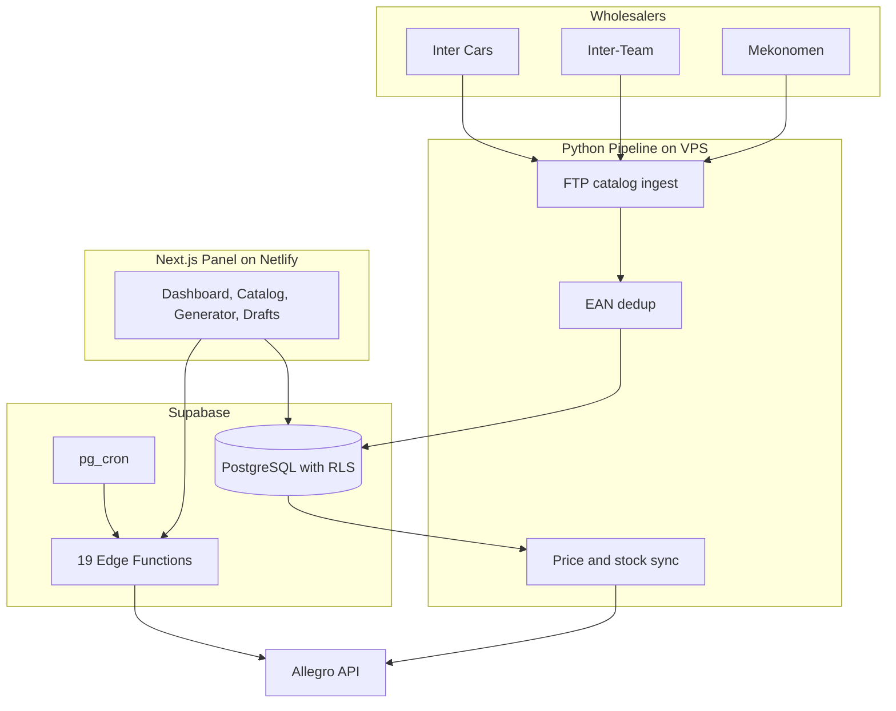

<p align="center"></p>

<h1 align="center">int3gro.pl</h1>

<h3 align="center">Allegro integration platform for an automotive parts store. Three wholesaler catalogs in one system, tens of thousands of offers under constant control.</h3>

<p align="center">
  
  
  
  
  
  
</p>

---

## Table of Contents

- [About](#about)
- [Screenshots](#screenshots)
- [Source Code](#source-code)
- [Tech Stack](#tech-stack)
- [Features](#features)
- [Production Incidents](#production-incidents)
- [Architecture](#architecture)
- [Statistics](#statistics)
- [My Role](#my-role)
- [Contact](#contact)

---

## About

An automotive parts store sells on Allegro, Poland's largest marketplace, sourcing stock from three wholesalers. The same part appears at several suppliers at different prices, stock levels change daily, and manual offer management at this scale is not an option. Selling a part that is out of stock, or pricing below cost, means real money lost.

The system closes this loop. Every night it pulls the wholesaler catalogs and merges them into one: the same product is matched by EAN code, the lowest purchase price wins. Prices and stock sync to Allegro offers throughout the day. An offer with no stock ends by itself; when the stock returns, the offer comes back. The web panel shows the catalog, generates offers with margin calculation, and handles orders: the system places the order with the right wholesaler on its own.

In production since May 2025. As of July 15, 2026: 28,634 active offers, wholesaler catalogs totaling over a million entries before deduplication. I maintain the system daily: production incidents get fixed without stopping sales.

---

## Screenshots

| Dashboard: offers, orders, pipeline health | Catalog: one part, prices from three wholesalers |
|:---:|:---:|
|  |  |

| Offer generator with margin calculation | Drafts ready to publish |
|:---:|:---:|
|  |  |

> **Note:** the screenshots are faithful mockups of the panel with fictional products, prices, and buyers. No client data or production offers are published.

---

## Source Code

The code is private and confidential (a client's production system). This repository documents the project: description, architecture, and screenshots.

---

## Tech Stack

### Web Panel

```
Next.js 16 + React 19      // App Router, SSR auth, 5 views
TypeScript 5               // 28 .tsx files in the panel
Tailwind CSS 3.4           // UI, TanStack Table 8
Netlify                    // panel hosting
```

### Backend and Data

```
Supabase PostgreSQL        // merged catalog, RLS, views
19 Edge Functions          // Allegro API, supplier ordering, offer lifecycle
pg_cron                    // 8 active jobs (orders, statuses, offers)
pg_trgm                    // catalog search
48 SQL migrations
```

### Pipeline (VPS)

```
Python 3                   // nightly FTP ingest, EAN dedup, price and stock sync
11 nightly pipeline scripts // plus Allegro sync every 3 h
Allegro REST API           // offers, orders, categories, fulfillment
Wholesaler integrations    // Inter Cars (OAuth), Inter-Team (mTLS), Mekonomen (SOAP)
```

---

## Features

### Catalog and Pricing

- **One catalog from three wholesalers** - the same product matched by EAN code, the lowest purchase price wins. The store always sells from the cheapest source
- **Nightly synchronization** - every night the system pulls fresh catalogs and stock levels. In the morning, offers reflect warehouse reality
- **Automatic offer ending** - when a part goes out of stock, the offer ends by itself. No customer buys a part that does not exist
- **Reactivation on restock** - when stock returns, the offer comes back with an up-to-date price. Nobody reviews thousands of listings by hand
- **Minimum price guard** - the system blocks publishing below cost: purchase price, tax, commission, buffer. Pricing mistakes stop costing money

### Panel

- **KPI dashboard** - active offers, drafts, orders by status, and nightly pipeline health on one screen
- **Catalog search** - hundreds of thousands of entries by name and EAN, with the Allegro category tree
- **Offer generator** - product selection, margins, minimum and target price calculation. Bulk draft creation
- **Draft catalog** - review, bulk publish and delete, with per-unit profit shown before publishing

### Orders

- **Supplier ordering without retyping** - an Allegro order reaches the right wholesaler with one click from the panel
- **Real-time statuses** - every few minutes the system polls Allegro for new orders and status changes

### Operations

- **Single token owner** - Allegro token refresh happens in one place, with a lock against parallel use. No more races that logged the system out
- **Bulk operation limits** - mass offer ending has a per-run limit and a nightly quiet window during catalog rebuild
- **Nightly report** - after every pipeline run the system emails a report with results and errors

---

## Production Incidents

Production where a bug costs money. Four cases from the incident documentation:

- **June 2026: the Allegro token race.** Verification tools consumed the single-use refresh token and logged the whole system out. Fix: one module owns the token, with a lock and a cache. The panel recovered the same day
- **July 2026: mass offer ending.** The job that ends zero-stock offers ran during the catalog rebuild window and ended around 29,000 offers. Reactivation the same night, then a correction of 938 offers that came back unwanted. After the incident: a per-run limit and a nightly quiet window
- **July 2026: stale price ranges.** The price-change queue fed the consumer values from months earlier and two offers sold below cost. Fix: a latest-wins rule when reading the queue, a minimum price guard, and a full comparison of every price rule against what Allegro actually shows
- **July 2026: permissions cutover.** Moving to new database access rules logged the panel out despite correct configuration. Diagnosis layer by layer: hosting, middleware, permissions, cron secrets

---

## Architecture



---

## Statistics

### Technical Complexity

| Metric | Count |
|---|---|
| **Commits** | 160 (May 2025 - July 2026) |
| **Production branch authors** | 1 |
| **Lines of Python** | 14,908 |
| **Lines of TS/TSX** | 18,255 |
| **SQL migrations** | 48 |
| **Edge Functions** | 19 |
| **Nightly pipeline scripts** | 11 |
| **Scheduled database jobs** | 8 active |
| **Integrated wholesalers** | 3 |

### Production Scale

| Metric | Count |
|---|---|
| **Active Allegro offers** | 28,634 (2026-07-15) |
| **Wholesaler catalog entries** | 481k + 457k + 149k rows before deduplication |
| **Reactivations after incident** | 29,958 offers in a single recovery run |

### Features Overview

| Category | Highlights |
|---|---|
| **Catalog** | EAN dedup, cheapest source, search |
| **Offers** | margin generator, drafts, price guard, reactivation |
| **Orders** | supplier ordering from the panel, statuses every few minutes |
| **Operations** | nightly pipeline, bulk operation limits, email reports |

---

## My Role

All code on the production branch is mine: 160 commits, May 2025 - July 2026 (pipeline, panel, backend functions, migrations). My business partner [Wojtek](https://github.com/wandrysiak): joint architecture decisions and client contact.

---

## Contact

| Platform | Link |
|---|---|
| **WWW** | [kamilkaczmareksolutions.com](https://kamilkaczmareksolutions.com) |
| **GitHub** | [kamilkaczmareksolutions](https://github.com/kamilkaczmareksolutions) |
| **LinkedIn** | [Kamil Kaczmarek](https://www.linkedin.com/in/kamilkaczmareksolutions) |
| **Email** | [recruitment@kamilkaczmareksolutions.com](mailto:recruitment@kamilkaczmareksolutions.com) |

---

**int3gro.pl** - three wholesalers, one catalog, zero manual offer takedowns.

<p align="center"><em>Built by Kamil Kaczmarek</em></p>
