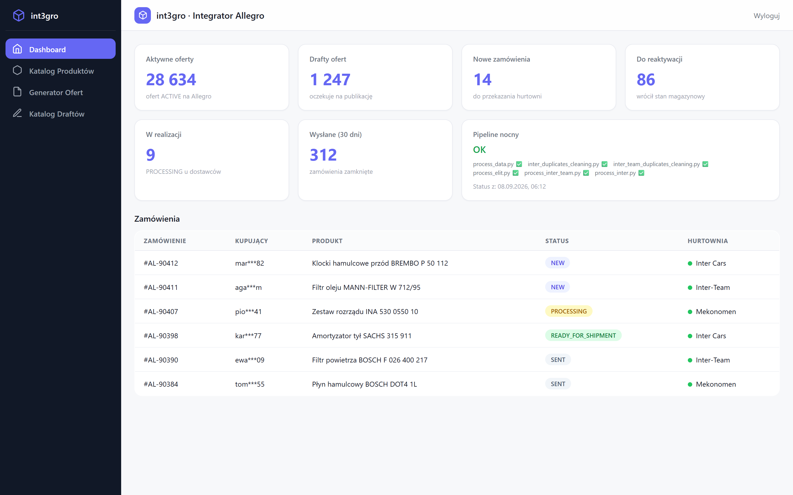
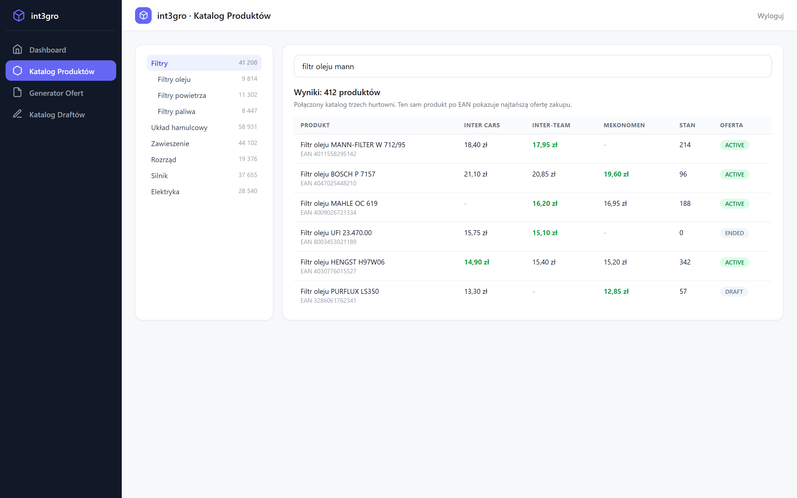
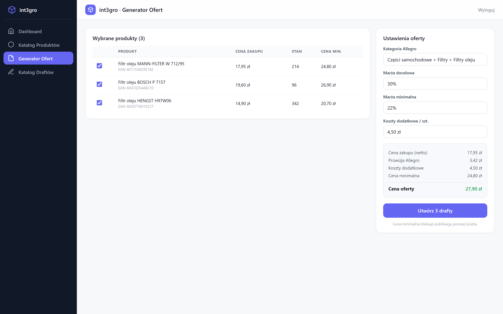
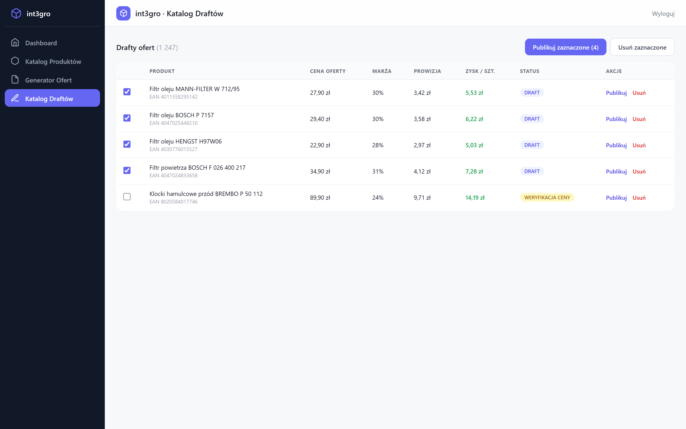
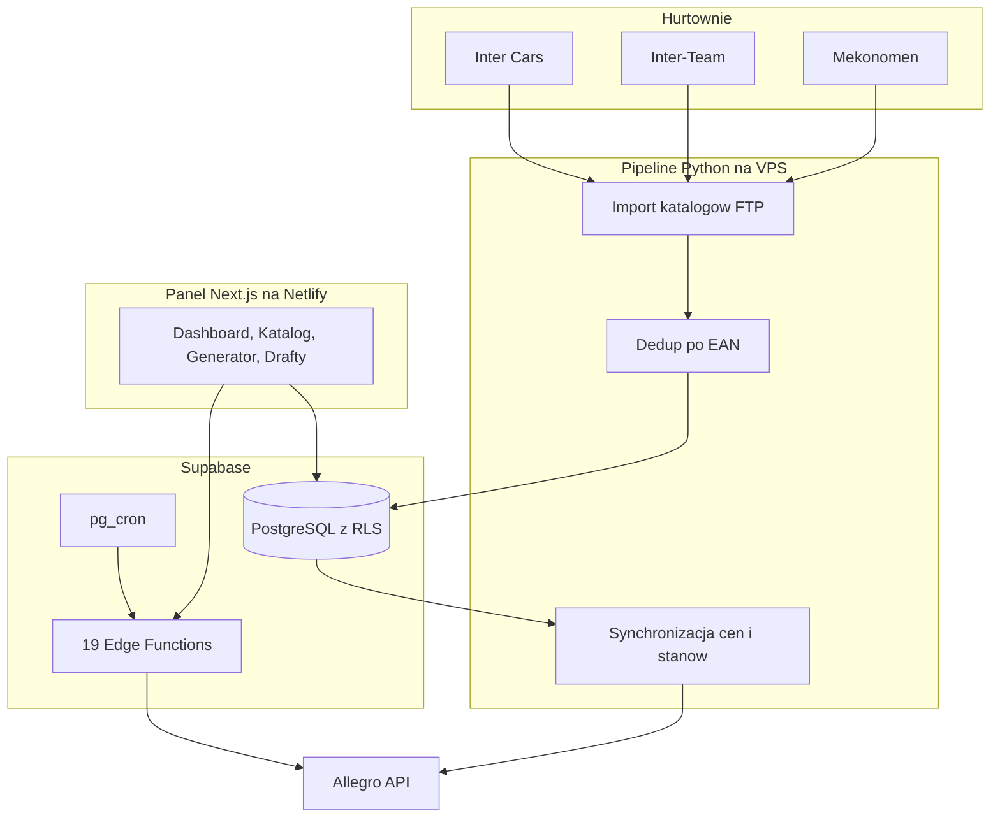

<p align="center"></p>

<h1 align="center">int3gro.pl</h1>

<h3 align="center">Integrator Allegro dla sklepu z częściami samochodowymi. Katalogi trzech hurtowni w jednym systemie, dziesiątki tysięcy ofert pod stałą kontrolą.</h3>

<p align="center">
  
  
  
  
  
  
</p>

---

## Spis treści

- [O projekcie](#o-projekcie)
- [Screenshoty](#screenshoty)
- [Kod źródłowy](#kod-źródłowy)
- [Stack](#stack)
- [Funkcje](#funkcje)
- [Incydenty produkcyjne](#incydenty-produkcyjne)
- [Architektura](#architektura)
- [Statystyki](#statystyki)
- [Moja rola](#moja-rola)
- [Kontakt](#kontakt)

---

## O projekcie

Sklep z częściami samochodowymi sprzedaje na Allegro towar z trzech hurtowni. Ta sama część bywa u kilku dostawców w różnych cenach, stany magazynowe zmieniają się codziennie, a ręczne wystawianie i zdejmowanie ofert przy tej skali nie istnieje. Sprzedaż części, której nie ma na stanie, albo cena poniżej kosztu to realna strata pieniędzy.

System domyka ten obieg. Co noc pobiera katalogi hurtowni i skleja je w jeden katalog: ten sam produkt rozpoznaje po kodzie EAN, wygrywa najniższa cena zakupu. Ceny i stany synchronizuje z ofertami na Allegro w ciągu dnia. Oferta bez stanu kończy się sama, po powrocie towaru wraca. Panel www pokazuje katalog, generuje oferty z kalkulacją marży i obsługuje zamówienia: system sam składa zamówienie u właściwej hurtowni.

Produkcja działa od maja 2025. Stan na 15 lipca 2026: 28 634 aktywne oferty, katalogi hurtowni o łącznej skali ponad miliona pozycji przed deduplikacją. System utrzymuję na co dzień: incydenty produkcyjne naprawiam bez zatrzymywania sprzedaży.

---

## Screenshoty

| Dashboard: oferty, zamówienia, zdrowie pipeline'u | Katalog: jedna część, ceny z trzech hurtowni |
|:---:|:---:|
|  |  |

| Generator ofert z kalkulacją marży | Drafty gotowe do publikacji |
|:---:|:---:|
|  |  |

> **Nota:** kadry to wierne makiety panelu z fikcyjnymi produktami, cenami i kupującymi. Dane klienta i produkcyjne oferty nie są publikowane.

---

## Kod źródłowy

Kod jest prywatny i poufny (system produkcyjny klienta). To repo dokumentuje projekt: opis, architekturę i zrzuty działania.

---

## Stack

### Panel www

```
Next.js 16 + React 19      // App Router, auth SSR, 5 widoków
TypeScript 5               // 28 plików .tsx w panelu
Tailwind CSS 3.4           // UI, TanStack Table 8
Netlify                    // hosting panelu
```

### Backend i dane

```
Supabase PostgreSQL        // połączony katalog, RLS, widoki
19 Edge Functions          // Allegro API, zamówienia u dostawców, cykl życia ofert
pg_cron                    // 8 aktywnych zadań (zamówienia, statusy, oferty)
pg_trgm                    // wyszukiwanie po katalogu
48 migracji SQL
```

### Pipeline (VPS)

```
Python 3                   // nocny import FTP, dedup EAN, sync cen i stanów
11 skryptów nocnego potoku // plus synchronizacja Allegro co 3 h
Allegro REST API           // oferty, zamówienia, kategorie, fulfillment
Integracje hurtowni        // Inter Cars (OAuth), Inter-Team (mTLS), Mekonomen (SOAP)
```

---

## Funkcje

### Katalog i ceny

- **Jeden katalog z trzech hurtowni** - ten sam produkt rozpoznawany po kodzie EAN, wygrywa najniższa cena zakupu. Sklep zawsze sprzedaje z najtańszego źródła
- **Nocna synchronizacja** - co noc system pobiera świeże katalogi i stany. Rano oferty odzwierciedlają rzeczywistość magazynową
- **Automatyczne kończenie ofert** - gdy część znika ze stanu, oferta kończy się sama. Klient nie kupi części, której nie ma
- **Reaktywacja po powrocie towaru** - gdy stan wraca, oferta wraca z aktualną ceną. Nikt nie przegląda ręcznie tysięcy pozycji
- **Strażnik ceny minimalnej** - system blokuje publikację poniżej kosztu: cena zakupu, podatek, prowizja, bufor. Błąd w cenie przestaje kosztować

### Panel

- **Dashboard z KPI** - aktywne oferty, drafty, zamówienia wg statusów i zdrowie nocnego pipeline'u na jednym ekranie
- **Wyszukiwanie w katalogu** - setki tysięcy pozycji po nazwie i EAN, z drzewem kategorii Allegro
- **Generator ofert** - wybór produktów, marże, kalkulacja ceny minimalnej i docelowej. Masowe tworzenie draftów
- **Katalog draftów** - przegląd, publikacja i usuwanie masowe, z zyskiem na sztuce przed publikacją

### Zamówienia

- **Zamówienia u dostawców bez przepisywania** - zamówienie z Allegro trafia do właściwej hurtowni jednym kliknięciem z panelu
- **Statusy na bieżąco** - co kilka minut system odpytuje Allegro o nowe zamówienia i zmiany statusów

### Utrzymanie

- **Jeden właściciel tokenu** - odświeżanie tokenu Allegro dzieje się w jednym miejscu, z blokadą przed równoległym użyciem. Koniec wyścigów, które wylogowywały system
- **Limity masowych operacji** - masowe kończenie ofert ma limit na przebieg i ciszę nocną w oknie przebudowy katalogu
- **Raport po nocy** - po każdym potokowym biegu system wysyła raport e-mail z wynikami i błędami

---

## Incydenty produkcyjne

Produkcja, w której błąd kosztuje pieniądze. Cztery przypadki z dokumentacji incydentów:

- **Czerwiec 2026: wyścig o token Allegro.** Narzędzia weryfikacyjne zużyły jednorazowy token odświeżania i wylogowały cały system. Naprawa: jeden moduł odpowiedzialny za token, z blokadą i cache. Panel wrócił tego samego dnia
- **Lipiec 2026: masowe zakończenie ofert.** Zadanie kończące oferty przy zerowym stanie odpaliło w oknie przebudowy katalogu i zakończyło ok. 29 tys. ofert. Reaktywacja tej samej nocy, potem korekta 938 ofert, które wróciły niechcący. Po incydencie: limit na przebieg i cisza nocna
- **Lipiec 2026: stare zakresy cen.** Kolejka zmian cen podała konsumentowi wartości sprzed miesięcy i dwie oferty sprzedały się poniżej kosztu. Naprawa: zasada "najnowszy wygrywa" przy odbieraniu z kolejki, strażnik ceny minimalnej i pełne porównanie reguł cenowych z tym, co faktycznie stoi na Allegro
- **Lipiec 2026: cutover uprawnień.** Przejście na nowe zasady dostępu do bazy wylogowało panel mimo poprawnej konfiguracji. Diagnoza warstwa po warstwie: hosting, middleware, uprawnienia, sekrety zadań cyklicznych

---

## Architektura



---

## Statystyki

### Złożoność techniczna

| Metryka | Wartość |
|---|---|
| **Commity** | 160 (maj 2025 - lipiec 2026) |
| **Autorzy gałęzi produkcyjnej** | 1 |
| **Linie Python** | 14 908 |
| **Linie TS/TSX** | 18 255 |
| **Migracje SQL** | 48 |
| **Edge Functions** | 19 |
| **Skrypty nocnego pipeline'u** | 11 |
| **Zadania cykliczne w bazie** | 8 aktywnych |
| **Zintegrowane hurtownie** | 3 |

### Skala produkcji

| Metryka | Wartość |
|---|---|
| **Aktywne oferty na Allegro** | 28 634 (15.07.2026) |
| **Pozycje w katalogach hurtowni** | 481 tys. + 457 tys. + 149 tys. wierszy przed deduplikacją |
| **Reaktywacje po incydencie** | 29 958 ofert w jednym biegu recovery |

### Przegląd funkcji

| Kategoria | Najważniejsze |
|---|---|
| **Katalog** | dedup po EAN, najtańsze źródło, wyszukiwanie |
| **Oferty** | generator z marżą, drafty, strażnik ceny, reaktywacja |
| **Zamówienia** | składanie u hurtowni z panelu, statusy co kilka minut |
| **Utrzymanie** | nocny pipeline, limity masowych operacji, raporty e-mail |

---

## Moja rola

Cały kod na gałęzi produkcyjnej jest mój: 160 commitów, maj 2025 - lipiec 2026 (pipeline, panel, funkcje backendowe, migracje). Wspólnik [Wojtek](https://github.com/wandrysiak): wspólne decyzje architektoniczne i kontakt z klientem.

---

## Kontakt

| Platforma | Link |
|---|---|
| **WWW** | [kamilkaczmareksolutions.com](https://kamilkaczmareksolutions.com) |
| **GitHub** | [kamilkaczmareksolutions](https://github.com/kamilkaczmareksolutions) |
| **LinkedIn** | [Kamil Kaczmarek](https://www.linkedin.com/in/kamilkaczmareksolutions) |
| **Email** | [recruitment@kamilkaczmareksolutions.com](mailto:recruitment@kamilkaczmareksolutions.com) |

---

**int3gro.pl** - trzy hurtownie, jeden katalog, zero ręcznego zdejmowania ofert.

<p align="center"><em>Zbudował Kamil Kaczmarek</em></p>
